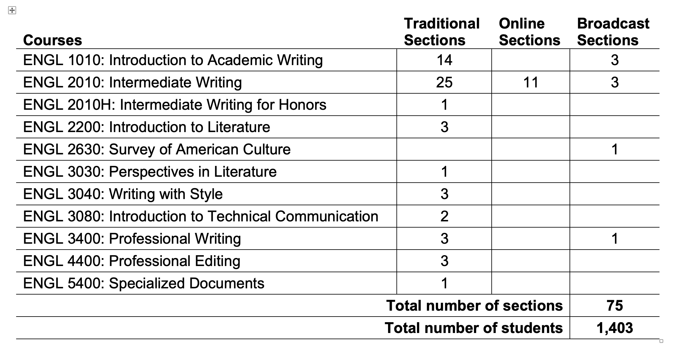

# Instructor Stats Project
* Developed by Emma Lynn (a02391851@usu.edu)
* Supervised by Neal Legler, CIDI Director (neal.legler@usu.edu)
* On request from Nikole Eyre, Senior Lecturer - English Department

## Requirements & Design
Nikole wants to get information from all the classes she's taught in the past 10 years, to fill in a table
like this one:

Tasks:
* Figure out how to pull the id of every course she has taught since Fall 2013
* Divide these courses by course and delivery method

### Data to return:

Course name
* Total sections: #
* Total students: #
* Traditional sections/students: #/#
* Online sections/students: #/#
* Broadcast sections/students: #/#
* Blended sections/students: #/#

## Progress

### 6.20.23
* The List courses for a user call looks very promising
* Nikole's a-number: a00344330

